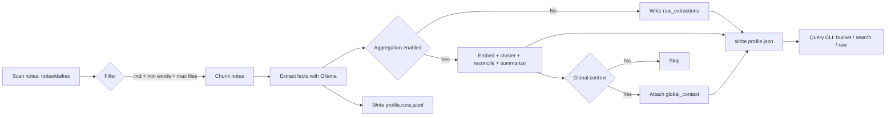

# Self Knowledge Extraction MVP

Simple pipeline that walks a portion of an Obsidian vault (defaults to `~/notes/dailies`), sends chunks of the notes to a local Ollama model, and aggregates the returned persona facts into `output/profile.json`.



## Quick start

```bash
cd /home/matth/Projects/SelfKnowledgeExtraction
nix-shell
python -m self_extract.cli init-config  # creates config.yaml
# edit config.yaml if needed (e.g. different ollama host or folder limit)
python -m self_extract.cli run -c config.yaml
exit  # leave the nix shell when you are done
```

To inspect the merged profile:

```bash
python -m self_extract.cli query --profile output/profile.json --bucket goals --search "exercise" --raw
```

The run command processes the first N markdown files (default 10) in `~/notes/dailies`, skipping notes shorter than 50 words. Results go to `output/profile.json` (bucket objects with canonical `items`, `summary`, and optional `_global_context`) and a per-chunk log in `output/profile.runs.jsonl`.

## Configuration

`config.yaml` keys:

- `vault_path`: Base path of your Obsidian vault (defaults to `~/notes`).
- `target_folder`: Folder inside the vault to scan (defaults to `dailies`).
- `input_paths`: List of folders or individual files (relative to the vault or absolute) to process; defaults to `["dailies"]` for backward compatibility.
- `filters.file_extensions`: File extensions to include (defaults to `.md`).
- `filters.min_word_count`: Minimum words per note for extraction.
- `filters.max_files`: Cap on number of notes processed per run (defaults to 10 for a quick MVP pass).
- `ollama.base_url`: Where your Ollama server is running.
- `ollama.model`: Model ID to call for chunk extraction (defaults to `gemma3:4b-it-qat`).
- `ollama.aggregator_model`: Model used to reconcile items across notes (defaults to `gemma3:12-it-qat`).
- `ollama.embedding_model`: Embedding model for semantic clustering before aggregation (defaults to `nomic-embed-text`).
- `aggregation.similarity_threshold`: Cosine similarity cut-off when grouping facts.
- `aggregation.embedding_batch_size`: Batch size for embedding calls.
- `aggregation.summary_max_items`: Maximum canonical items to feed into the summariser per bucket.
- `aggregation.enable_clustering`: Toggle semantic clustering (defaults to `true`).
- `aggregation.passes`: Number of aggregation passes to run (defaults to `1`).
- `aggregation.global_context`: If `true`, generates a vault-wide context summary between passes.
- `aggregation.enabled`: Master switch for aggregation; set `false` or `passes: 0` to emit raw results without consolidation.
- `prompts_path`: Location of `prompts.yaml`, which holds every prompt template.
- `extraction_targets`: Buckets to request from the model; each target can include a `name` and optional `description` used in prompts. Only these targets appear in the extraction schema sent to the LLM.
- `output_json`: Path for the merged JSON report.
- `cache_path`: Where the LLM response cache is stored; identical prompts on the same model reuse cached outputs.

## Notes

- Frontmatter `last_edited_date` (fallbacks: `last_edited_at`, `updated_at`, `modified`, `created_*`) timestamps extractions; make sure your notes include one of them.
- Semantic clustering keeps related facts together before the aggregator LLM resolves conflicts and writes summaries.
- Prompts live in `prompts.yaml`; tweak templates there (cluster/summary/global context). Use `{{PLACEHOLDER}}` syntax.
- Logs are kept alongside the JSON to make it easy to review how many items each chunk contributed.
- When `aggregation.global_context` is true, `_global_context` is added to the JSON with a long-form summary for downstream use.
- The output now stores `raw_extractions` (per chunk, pre-aggregation) and aggregated bucket entries enriched with `mentions`, `evidence`, and `governance` trails.
- Re-running the pipeline with unchanged prompts/model reuses cached LLM responses for faster execution.
- Use `python -m self_extract.cli query` to treat the profile like a lightweight database: filter by bucket, keywords, mention counts, or date ranges and optionally inspect raw chunk-level evidence.
