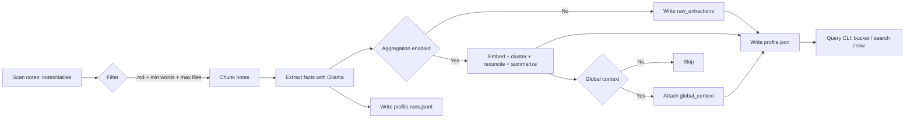

# Self Knowledge Extraction MVP

Simple pipeline that walks a portion of an Obsidian vault (defaults to `~/notes/dailies`), sends chunks of the notes to a local Ollama model, and aggregates the returned persona facts into `output/profile.json`.



## Quick start

```bash
cd /home/matth/Projects/SelfKnowledgeExtraction
# nix-shell # if you have nix installed
python -m self_extract.cli init-config  # creates config.yaml
# edit config.yaml if needed (e.g. different ollama host or folder limit)
python -m self_extract.cli run -c config.yaml
exit  # leave the nix shell when you are done
```

To inspect the merged profile:

```bash
python -m self_extract.cli query --profile output/profile.json --bucket goals --search "exercise" --raw
```

The run command processes the first N markdown files (default 10) in `~/notes/dailies`, skipping notes shorter than 50 words. Results go to `output/profile.json` (bucket objects with canonical `items`, `summary`, and optional `_global_context`) and a per-chunk log in `output/profile.runs.jsonl`.

## Personal Context Server

The Personal Context Server exposes the consolidated profile to local LLM agents via the Model Context Protocol (MCP) and provides a terminal UI for managing sharing rules.

1. Build the context database (computes embeddings) from the latest aggregated profile:

   ```bash
   python -m self_extract.cli context build-profile \
     --aggregated output/profile.json \
     --output output/profile-all.json
   ```

2. (Optional) Seed rules from `context-rules.example.json`:

   ```bash
   cp context-rules.example.json context-rules.json
   ```

3. Launch the MCP server for downstream tools:

   ```bash
   python -m self_extract.cli context serve --profile output/profile-all.json --rules context-rules.json
   ```

4. Inspect and edit rules in the TUI:

   ```bash
   python -m self_extract.cli context tui --profile output/profile-all.json --rules context-rules.json
   ```

The CLI also exposes `python -m self_extract.cli context search "query"` for quick checks. All commands run offline by default and reuse the `sentence-transformers` model specified via `--embedding-model`.

## Docker Context Server

Build a container image when you want to serve the MCP endpoint without managing a local Python environment:

```bash
docker build -t self-extract-context .
```

The server needs your aggregated profile and rule set; mount them into the container and publish the transport port when you launch it. The example below serves HTTP on `0.0.0.0:47771` using the defaults shipped in this repository:

```bash
docker run --rm \
  -p 47771:47771 \
  -v "$(pwd)/output:/app/output" \
  -v "$(pwd)/context-rules.json:/app/context-rules.json:ro" \
  self-extract-context \
  python -m self_extract.cli context serve \
    --profile output/profile-all.json \
    --rules context-rules.json \
    --transport http \
    --host 0.0.0.0 \
    --port 47771
```

Adjust the bind mounts if your profile or rule files live elsewhere. Additional CLI flags (e.g. `--embedding-model`) work the same way; append them to the end of the `docker run` command.

## Google OAuth Authentication

Secure the MCP endpoint with Google's OAuth 2.0 flow by using FastMCP's built-in Google provider. Create a Web application credential in the Google Cloud Console, add your public server URL under **Authorized JavaScript origins**, and register the callback at `<base-url>/auth/callback` (or your custom path). Then export the credentials and launch the server with `--auth-type google`:

```bash
export CONTEXT_AUTH_BASE_URL="https://your-server.com"
export CONTEXT_AUTH_CLIENT_ID="123456789.apps.googleusercontent.com"
export CONTEXT_AUTH_CLIENT_SECRET="GOCSPX-abc123..."
# Optional overrides:
# export CONTEXT_AUTH_REDIRECT_PATH="/auth/callback"
# export CONTEXT_AUTH_ALLOWED_REDIRECTS="http://localhost:*,https://claude.ai/*"
# export CONTEXT_AUTH_TIMEOUT_SECONDS="10"

python -m self_extract.cli context serve \
  --transport http \
  --host 0.0.0.0 \
  --port 47771 \
  --auth-type google \
  --auth-required-scope openid \
  --auth-required-scope https://www.googleapis.com/auth/userinfo.email
```

If you omit `--auth-required-scope`, the CLI requests `openid` and `userinfo.email` by default. Provide additional scopes either by repeating the flag or via `CONTEXT_AUTH_REQUIRED_SCOPES=scope1,scope2`.

## OAuth Proxy Authentication

Need to integrate with a different provider? Keep using FastMCP's OAuth Proxy. Register an OAuth 2.0 client with your identity provider, note the authorization and token endpoints, and configure the redirect URI as `<base-url>/auth/callback`. Then export the credentials and launch the server with `--auth-type oauth-proxy`:

```bash
export CONTEXT_AUTH_BASE_URL="https://your-server.com"
export CONTEXT_AUTH_CLIENT_ID="abc123"
export CONTEXT_AUTH_CLIENT_SECRET="super-secret"
export CONTEXT_AUTH_AUTHORIZATION_ENDPOINT="https://provider.com/oauth/authorize"
export CONTEXT_AUTH_TOKEN_ENDPOINT="https://provider.com/oauth/token"
export CONTEXT_AUTH_JWKS_URI="https://provider.com/.well-known/jwks.json"
export CONTEXT_AUTH_ISSUER="https://provider.com/"
export CONTEXT_AUTH_AUDIENCE="your-api-id"

python -m self_extract.cli context serve \
  --transport http \
  --host 0.0.0.0 \
  --port 47771 \
  --auth-type oauth-proxy
```

Optional environment variables fine-tune the proxy:

- `CONTEXT_AUTH_REDIRECT_PATH`: override the callback path (defaults to `/auth/callback`)
- `CONTEXT_AUTH_ALLOWED_REDIRECTS`: comma-separated patterns to restrict MCP client redirect URIs (e.g. `http://localhost:*,https://claude.ai/*`)
- `CONTEXT_AUTH_REQUIRED_SCOPES`: scopes that must appear on provider tokens (comma-separated)
- `CONTEXT_AUTH_VALID_SCOPES`: scopes to advertise through the MCP discovery endpoints

You can also append CLI flags such as `--auth-authorize-param audience=https://api.example.com` or `--auth-token-param resource=https://api.example.com` to forward provider-specific parameters. Disable PKCE forwarding when required with `--no-auth-forward-pkce`, or set a specific token endpoint auth method via `--auth-token-endpoint-method client_secret_post`.

## Configuration

`config.yaml` keys:

- `vault_path`: Base path of your Obsidian vault (defaults to `~/notes`).
- `target_folder`: Folder inside the vault to scan (defaults to `dailies`).
- `input_paths`: List of folders or individual files (relative to the vault or absolute) to process; defaults to `["dailies"]` for backward compatibility.
- `filters.file_extensions`: File extensions to include (defaults to `.md`).
- `filters.min_word_count`: Minimum words per note for extraction.
- `filters.max_files`: Cap on number of notes processed per run (defaults to 10 for a quick MVP pass).
- `ollama.base_url`: Where your Ollama server is running.
- `ollama.model`: Model ID to call for chunk extraction (defaults to `gemma3:4b-it-qat`).
- `ollama.aggregator_model`: Model used to reconcile items across notes (defaults to `gemma3:12-it-qat`).
- `ollama.embedding_model`: Embedding model for semantic clustering before aggregation (defaults to `nomic-embed-text`).
- `aggregation.similarity_threshold`: Cosine similarity cut-off when grouping facts.
- `aggregation.embedding_batch_size`: Batch size for embedding calls.
- `aggregation.summary_max_items`: Maximum canonical items to feed into the summariser per bucket.
- `aggregation.enable_clustering`: Toggle semantic clustering (defaults to `true`).
- `aggregation.passes`: Number of aggregation passes to run (defaults to `1`).
- `aggregation.global_context`: If `true`, generates a vault-wide context summary between passes.
- `aggregation.enabled`: Master switch for aggregation; set `false` or `passes: 0` to emit raw results without consolidation.
- `prompts_path`: Location of `prompts.yaml`, which holds every prompt template.
- `extraction_targets`: Buckets to request from the model; each target can include a `name` and optional `description` used in prompts. Only these targets appear in the extraction schema sent to the LLM.
- `output_json`: Path for the merged JSON report.
- `cache_path`: Where the LLM response cache is stored; identical prompts on the same model reuse cached outputs.

## Notes

- Frontmatter `last_edited_date` (fallbacks: `last_edited_at`, `updated_at`, `modified`, `created_*`) timestamps extractions; make sure your notes include one of them.
- Semantic clustering keeps related facts together before the aggregator LLM resolves conflicts and writes summaries.
- Prompts live in `prompts.yaml`; tweak templates there (cluster/summary/global context). Use `{{PLACEHOLDER}}` syntax.
- Logs are kept alongside the JSON to make it easy to review how many items each chunk contributed.
- When `aggregation.global_context` is true, `_global_context` is added to the JSON with a long-form summary for downstream use.
- The output now stores `raw_extractions` (per chunk, pre-aggregation) and aggregated bucket entries enriched with `mentions`, `evidence`, and `governance` trails.
- Re-running the pipeline with unchanged prompts/model reuses cached LLM responses for faster execution.
- Use `python -m self_extract.cli query` to treat the profile like a lightweight database: filter by bucket, keywords, mention counts, or date ranges and optionally inspect raw chunk-level evidence.
